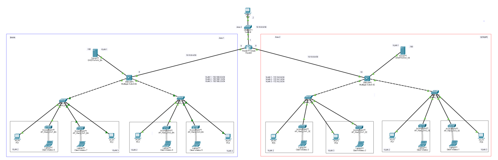

# Projeto Numero 01

## Requisitos

1. De acordo com a tabela de endereços abaixo e o seu número na lista de chamada, descrito na
última folha desse documento, configure o endereçamento IP do cenário proposto;
1. O protocolo OSPF deve ser usado para convergência total do roteamento;
1. Os servidores DHCP em cada localidade devem fornecer IPs para todas s VLANs do mesmo
site;
1. Em cada rede deve ser usado um access point e um cliente Wireless pegando IP do servidor
DHCP.

**OBS: Adicione os endereços de todos os hosts como notas no arquivo do packet tracer.**

  Site  |      VLAN1     |      VLAN2       |   VLAN3
   ---  |       ----     |       ----       |    ---- 
Bahia   | 192.168.X.0/24 | 192.168.X+1.0/24 | 192.168.X+2.0/24
Sergipe | 172.16.X.0/24  | 172.16.X+1.0/24  | 172.16.X+2.0/24

## Projeto Lógico



## Configurações

### Router0

```router0
Building configuration...

Current configuration : 756 bytes
!
version 12.2
no service timestamps log datetime msec
no service timestamps debug datetime msec
no service password-encryption
!
hostname Router
!
!
!
!
!
!
!
!
no ip cef
no ipv6 cef
!
!
!
!
!
!
!
!
!
!
!
!
!
!
!
!
!
!
interface GigabitEthernet0/0
 ip address 10.10.0.1 255.255.255.252
 duplex auto
 speed auto
!
interface GigabitEthernet1/0
 ip address 10.10.0.5 255.255.255.252
 duplex auto
 speed auto
!
interface GigabitEthernet2/0
 ip address 10.10.0.9 255.255.255.252
 duplex auto
 speed auto
!
router ospf 1
 log-adjacency-changes
 network 10.10.0.4 0.0.0.3 area 1
 network 10.10.0.0 0.0.0.3 area 0
 network 10.10.0.8 0.0.0.3 area 2
!
ip classless
!
ip flow-export version 9
!
!
!
!
!
!
!
!
line con 0
!
line aux 0
!
line vty 0 4
 login
!
!
!
end

```

### Multilayer Switch BA

```MultilayerSwitchBA
Building configuration...

Current configuration : 1869 bytes
!
version 12.2(37)SE1
no service timestamps log datetime msec
no service timestamps debug datetime msec
no service password-encryption
!
hostname MultilayerSwitchBA
!
!
!
!
!
!
ip routing
!
!
!
!
!
!
!
!
!
!
!
!
!
!
!
spanning-tree mode pvst
!
!
!
!
!
!
interface FastEthernet0/1
!
interface FastEthernet0/2
!
interface FastEthernet0/3
!
interface FastEthernet0/4
!
interface FastEthernet0/5
!
interface FastEthernet0/6
!
interface FastEthernet0/7
!
interface FastEthernet0/8
!
interface FastEthernet0/9
!
interface FastEthernet0/10
!
interface FastEthernet0/11
!
interface FastEthernet0/12
!
interface FastEthernet0/13
!
interface FastEthernet0/14
!
interface FastEthernet0/15
!
interface FastEthernet0/16
!
interface FastEthernet0/17
!
interface FastEthernet0/18
!
interface FastEthernet0/19
!
interface FastEthernet0/20
!
interface FastEthernet0/21
!
interface FastEthernet0/22
!
interface FastEthernet0/23
 switchport trunk encapsulation dot1q
 switchport mode trunk
 switchport nonegotiate
!
interface FastEthernet0/24
 switchport trunk encapsulation dot1q
 switchport mode trunk
 switchport nonegotiate
!
interface GigabitEthernet0/1
 switchport access vlan 4
!
interface GigabitEthernet0/2
!
interface Vlan1
 ip address 192.168.0.254 255.255.255.0
!
interface Vlan2
 mac-address 0001.974a.2601
 ip address 192.168.1.254 255.255.255.0
 ip helper-address 192.168.0.100
!
interface Vlan3
 mac-address 0001.974a.2602
 ip address 192.168.2.254 255.255.255.0
 ip helper-address 192.168.0.100
!
interface Vlan4
 mac-address 0001.974a.2603
 ip address 10.10.0.6 255.255.255.252
!
router ospf 1
 log-adjacency-changes
 network 10.10.0.4 0.0.0.3 area 1
 network 192.168.0.0 0.0.0.255 area 1
 network 192.168.1.0 0.0.0.255 area 1
 network 192.168.2.0 0.0.0.255 area 1
!
ip classless
!
ip flow-export version 9
!
!
!
!
!
!
!
!
line con 0
!
line aux 0
!
line vty 0 4
 login
!
!
!
!
end
```

### Switch_BA1

```Switch_BA1
Building configuration...

Current configuration : 1679 bytes
!
version 12.2
no service timestamps log datetime msec
no service timestamps debug datetime msec
no service password-encryption
!
hostname Switch_BA1
!
!
!
!
!
!
spanning-tree mode pvst
spanning-tree extend system-id
!
interface FastEthernet0/1
 switchport access vlan 2
!
interface FastEthernet0/2
 switchport access vlan 2
!
interface FastEthernet0/3
 switchport access vlan 2
!
interface FastEthernet0/4
 switchport access vlan 2
!
interface FastEthernet0/5
 switchport access vlan 2
!
interface FastEthernet0/6
 switchport access vlan 2
!
interface FastEthernet0/7
 switchport access vlan 2
!
interface FastEthernet0/8
 switchport access vlan 2
!
interface FastEthernet0/9
 switchport access vlan 2
!
interface FastEthernet0/10
 switchport access vlan 2
!
interface FastEthernet0/11
 switchport access vlan 3
!
interface FastEthernet0/12
 switchport access vlan 3
!
interface FastEthernet0/13
 switchport access vlan 3
!
interface FastEthernet0/14
 switchport access vlan 3
!
interface FastEthernet0/15
 switchport access vlan 3
!
interface FastEthernet0/16
 switchport access vlan 3
!
interface FastEthernet0/17
 switchport access vlan 3
!
interface FastEthernet0/18
 switchport access vlan 3
!
interface FastEthernet0/19
 switchport access vlan 3
!
interface FastEthernet0/20
 switchport access vlan 3
!
interface FastEthernet0/21
!
interface FastEthernet0/22
!
interface FastEthernet0/23
!
interface FastEthernet0/24
 switchport mode trunk
!
interface GigabitEthernet0/1
!
interface GigabitEthernet0/2
!
interface Vlan1
 no ip address
!
interface Vlan2
 no ip address
!
interface Vlan3
 no ip address
!
!
!
!
line con 0
!
line vty 0 4
 login
line vty 5 15
 login
!
!
!
!
end
```

### Switch_BA2

```Switch_BA2
Building configuration...

Current configuration : 1679 bytes
!
version 12.2
no service timestamps log datetime msec
no service timestamps debug datetime msec
no service password-encryption
!
hostname Switch_BA2
!
!
!
!
!
!
spanning-tree mode pvst
spanning-tree extend system-id
!
interface FastEthernet0/1
 switchport access vlan 2
!
interface FastEthernet0/2
 switchport access vlan 2
!
interface FastEthernet0/3
 switchport access vlan 2
!
interface FastEthernet0/4
 switchport access vlan 2
!
interface FastEthernet0/5
 switchport access vlan 2
!
interface FastEthernet0/6
 switchport access vlan 2
!
interface FastEthernet0/7
 switchport access vlan 2
!
interface FastEthernet0/8
 switchport access vlan 2
!
interface FastEthernet0/9
 switchport access vlan 2
!
interface FastEthernet0/10
 switchport access vlan 2
!
interface FastEthernet0/11
 switchport access vlan 3
!
interface FastEthernet0/12
 switchport access vlan 3
!
interface FastEthernet0/13
 switchport access vlan 3
!
interface FastEthernet0/14
 switchport access vlan 3
!
interface FastEthernet0/15
 switchport access vlan 3
!
interface FastEthernet0/16
 switchport access vlan 3
!
interface FastEthernet0/17
 switchport access vlan 3
!
interface FastEthernet0/18
 switchport access vlan 3
!
interface FastEthernet0/19
 switchport access vlan 3
!
interface FastEthernet0/20
 switchport access vlan 3
!
interface FastEthernet0/21
!
interface FastEthernet0/22
!
interface FastEthernet0/23
!
interface FastEthernet0/24
 switchport mode trunk
!
interface GigabitEthernet0/1
!
interface GigabitEthernet0/2
!
interface Vlan1
 no ip address
!
interface Vlan2
 no ip address
!
interface Vlan3
 no ip address
!
!
!
!
line con 0
!
line vty 0 4
 login
line vty 5 15
 login
!
!
!
!
end
```

### Multilayer Switch SE

```MultilayerSwitchSE
Building configuration...

Current configuration : 1862 bytes
!
version 12.2(37)SE1
no service timestamps log datetime msec
no service timestamps debug datetime msec
no service password-encryption
!
hostname MultilayerSwitchSE
!
!
!
!
!
!
ip routing
!
!
!
!
!
!
!
!
!
!
!
!
!
!
!
spanning-tree mode pvst
!
!
!
!
!
!
interface FastEthernet0/1
!
interface FastEthernet0/2
!
interface FastEthernet0/3
!
interface FastEthernet0/4
!
interface FastEthernet0/5
!
interface FastEthernet0/6
!
interface FastEthernet0/7
!
interface FastEthernet0/8
!
interface FastEthernet0/9
!
interface FastEthernet0/10
!
interface FastEthernet0/11
!
interface FastEthernet0/12
!
interface FastEthernet0/13
!
interface FastEthernet0/14
!
interface FastEthernet0/15
!
interface FastEthernet0/16
!
interface FastEthernet0/17
!
interface FastEthernet0/18
!
interface FastEthernet0/19
!
interface FastEthernet0/20
!
interface FastEthernet0/21
!
interface FastEthernet0/22
!
interface FastEthernet0/23
 switchport trunk encapsulation dot1q
 switchport mode trunk
 switchport nonegotiate
!
interface FastEthernet0/24
 switchport trunk encapsulation dot1q
 switchport mode trunk
 switchport nonegotiate
!
interface GigabitEthernet0/1
 switchport access vlan 4
!
interface GigabitEthernet0/2
!
interface Vlan1
 ip address 172.16.0.254 255.255.255.0
!
interface Vlan2
 mac-address 0090.2b64.c101
 ip address 172.16.1.254 255.255.255.0
 ip helper-address 172.16.0.100
!
interface Vlan3
 mac-address 0090.2b64.c102
 ip address 172.16.2.254 255.255.255.0
 ip helper-address 172.16.0.100
!
interface Vlan4
 mac-address 0090.2b64.c103
 ip address 10.10.0.10 255.255.255.252
!
router ospf 1
 log-adjacency-changes
 network 10.10.0.8 0.0.0.3 area 2
 network 172.16.0.0 0.0.0.255 area 2
 network 172.16.1.0 0.0.0.255 area 2
 network 172.16.2.0 0.0.0.255 area 2
!
ip classless
!
ip flow-export version 9
!
!
!
!
!
!
!
!
line con 0
!
line aux 0
!
line vty 0 4
 login
!
!
!
!
end
```

### Switch_SE1

```Switch_SE1
Building configuration...

Current configuration : 1679 bytes
!
version 12.2
no service timestamps log datetime msec
no service timestamps debug datetime msec
no service password-encryption
!
hostname SwitchSE1
!
!
!
!
!
!
spanning-tree mode pvst
spanning-tree extend system-id
!
interface FastEthernet0/1
 switchport access vlan 2
!
interface FastEthernet0/2
 switchport access vlan 2
!
interface FastEthernet0/3
 switchport access vlan 2
!
interface FastEthernet0/4
 switchport access vlan 2
!
interface FastEthernet0/5
 switchport access vlan 2
!
interface FastEthernet0/6
 switchport access vlan 2
!
interface FastEthernet0/7
 switchport access vlan 2
!
interface FastEthernet0/8
 switchport access vlan 2
!
interface FastEthernet0/9
 switchport access vlan 2
!
interface FastEthernet0/10
 switchport access vlan 2
!
interface FastEthernet0/11
 switchport access vlan 3
!
interface FastEthernet0/12
 switchport access vlan 3
!
interface FastEthernet0/13
 switchport access vlan 3
!
interface FastEthernet0/14
 switchport access vlan 3
!
interface FastEthernet0/15
 switchport access vlan 3
!
interface FastEthernet0/16
 switchport access vlan 3
!
interface FastEthernet0/17
 switchport access vlan 3
!
interface FastEthernet0/18
 switchport access vlan 3
!
interface FastEthernet0/19
 switchport access vlan 3
!
interface FastEthernet0/20
 switchport access vlan 3
!
interface FastEthernet0/21
!
interface FastEthernet0/22
!
interface FastEthernet0/23
!
interface FastEthernet0/24
 switchport mode trunk
!
interface GigabitEthernet0/1
!
interface GigabitEthernet0/2
!
interface Vlan1
 no ip address
!
interface Vlan2
 no ip address
!
interface Vlan3
 no ip address
!
!
!
!
line con 0
!
line vty 0 4
 login
line vty 5 15
 login
!
!
!
!
end
```

### Switch_SE2

```Switch_SE2
Building configuration...

Current configuration : 1679 bytes
!
version 12.2
no service timestamps log datetime msec
no service timestamps debug datetime msec
no service password-encryption
!
hostname SwitchSE2
!
!
!
!
!
!
spanning-tree mode pvst
spanning-tree extend system-id
!
interface FastEthernet0/1
 switchport access vlan 2
!
interface FastEthernet0/2
 switchport access vlan 2
!
interface FastEthernet0/3
 switchport access vlan 2
!
interface FastEthernet0/4
 switchport access vlan 2
!
interface FastEthernet0/5
 switchport access vlan 2
!
interface FastEthernet0/6
 switchport access vlan 2
!
interface FastEthernet0/7
 switchport access vlan 2
!
interface FastEthernet0/8
 switchport access vlan 2
!
interface FastEthernet0/9
 switchport access vlan 2
!
interface FastEthernet0/10
 switchport access vlan 2
!
interface FastEthernet0/11
 switchport access vlan 3
!
interface FastEthernet0/12
 switchport access vlan 3
!
interface FastEthernet0/13
 switchport access vlan 3
!
interface FastEthernet0/14
 switchport access vlan 3
!
interface FastEthernet0/15
 switchport access vlan 3
!
interface FastEthernet0/16
 switchport access vlan 3
!
interface FastEthernet0/17
 switchport access vlan 3
!
interface FastEthernet0/18
 switchport access vlan 3
!
interface FastEthernet0/19
 switchport access vlan 3
!
interface FastEthernet0/20
 switchport access vlan 3
!
interface FastEthernet0/21
!
interface FastEthernet0/22
!
interface FastEthernet0/23
!
interface FastEthernet0/24
 switchport mode trunk
!
interface GigabitEthernet0/1
!
interface GigabitEthernet0/2
!
interface Vlan1
 no ip address
!
interface Vlan2
 no ip address
!
interface Vlan3
 no ip address
!
!
!
!
line con 0
!
line vty 0 4
 login
line vty 5 15
 login
!
!
!
!
end
```